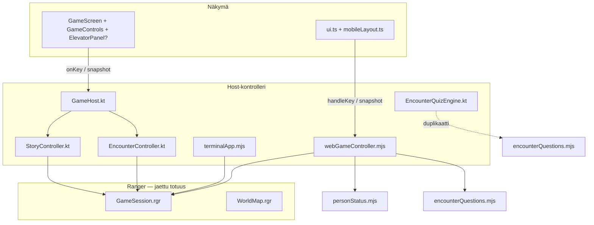

# Android vs web: kontrollerilogiikka ja hissipariteetti

Analyysi päivitetty **2026-06-22**: missä pelilogiikka asuu Rangerissa, missä host-kontrollerissa (web/terminaali), ja mitä Androidista vielä puuttuu.

---

## Tilanne nyt (2026-06-22)

| Ominaisuus | Web | Android |
|------------|-----|---------|
| Ranger-ydin (liike, hissi, kohtaukset) | ✅ | ✅ |
| Hissinumeroruudukko + collapse | ✅ | ✅ `ElevatorPanel` + `ElevatorUiState` |
| Kerroslukot (`canAccessFloor`) | ✅ | ✅ |
| Suositusportti ylöspäin | ✅ `personStatus.mjs` | ✅ `PersonRegistry` + `ElevatorKeyGate` |
| Encounter-dialogi (1–3) | ✅ | ✅ |
| Encounter-quiz + vastaukset | ✅ | ✅ |
| Quiz-sivutoiminnot (n/a/j/i/m) | ✅ | ✅ (2026-06-22) |
| Kortin palautus -overlay | ✅ | ✅ (2026-06-22) |
| Opiskelulista (`b`) | ✅ + tallennus | ✅ UI + `StudyBacklog` (ei persist) |
| Inventaario (`i`) | ✅ | ✅ UI |
| Valikko (`?`) | ✅ | ✅ `MenuController` |
| Vankila / game over | ✅ | ✅ kartta + Jatka-nappi |
| `action_story` työkalukohtauksista | ✅ | ✅ `tryStartActionStory` |
| HR 2. kerroksella + seek | ✅ Ranger | ✅ Ranger + `syncHrGreeter` |
| Kartta: suositusmerkit `!` | ✅ `applyMapPersonDisplay` | ❌ |
| Tallennus (karma, registry, quiz-historia) | ✅ localStorage | ❌ |
| Cast list debug (`o`) | ✅ | ❌ |
| Quiz-kysymysvalinta | `encounterQuestions.mjs` | `EncounterQuizEngine.kt` (kopio) |

**Host-pariteetti arvio:** ~**75%** (aiemmin ~28%). Suurimmat jäljellä olevat gapit: persistenssi, karttanäytön personDisplay, quiz-engine deduplikaatio.

---

## Uudelleenkäytön yhteenveto (%)

Arviot perustuvat rivimääriin (`lib/game/ranger/` ~5 700, web-host ~2 700, web-UI ~1 300, Android-host ~750, Android-UI ~650).

- **Uudelleenkäyttö** = yksi lähdekoodi / yksi totuus kaikilla alustoilla (Ranger-käännös, jaettu snapshot-skeema, ei JS+Kotlin-kopioita).
- **Pariteetti** = webin toiminnallisuus Androidissa (voi olla kopioitu, ei vielä jaettu lähdettä).
- **Tavoite** = kun Vaiheet 1–3 (dokumentin lopussa) on tehty: yhteinen `GameController`-snapshot, hissigridi, `personRegistry`, quiz yhdestä lähteestä.

### Kokonaiskuva

| Kerros | Rivejä (noin) | Uudelleenkäyttö nyt | Uudelleenkäyttö tavoite | Pariteetti nyt | Pariteetti tavoite |
|--------|---------------|--------------------:|------------------------:|---------------:|-------------------:|
| **Ranger** (peliydin) | ~5 700 | **100%** | **100%** | **100%** | **100%** |
| **Host-kontrolleri** | ~2 700 JS / ~1 100 Kotlin | **~15%** | **~75%** | **~75%** | **~92%** |
| **Näkymä** (UI) | ~1 300 TS / ~900 Compose | **0%**¹ | **~10%**² | **~70%** | **~90%** |
| **Yhteensä (client)** | ~10 400 | **~55%** | **~78%** | **~72%** | **~90%** |

¹ Eri teknologia (DOM vs Compose) — jaettavissa vain snapshot-skeema, ei renderöintikoodia.  
² Tavoite: sama snapshot-JSON/struct molemmille; UI pysyy alustakohtaisena.

### Ominaisuuskohtaisesti

| Osio | Uudelleenkäyttö nyt | Uudelleenkäyttö tavoite | Pariteetti nyt | Pariteetti tavoite | Huom / miten tavoite saavutetaan |
|------|--------------------:|------------------------:|---------------:|-------------------:|----------------------------------|
| Kartta & liike | **100%** | **100%** | **~85%** | **~95%** | Ranger ✅; tavoite: `applyMapPersonDisplay` Androidiin |
| Hissi — matka & lukot | **100%** | **100%** | **100%** | **100%** | Ranger ✅ |
| Hissi — numeronäyttö | **0%** | **~85%**³ | **100%** | **100%** | ✅ toteutettu |
| Suositusportti (ylöspäin) | **0%** | **~90%** | **100%** | **100%** | ✅ `PersonRegistry.kt` |
| Encounter — dialogi | **100%** | **100%** | **~90%** | **~95%** | Ranger ✅ |
| Encounter — quiz | **0%**⁴ | **~95%** | **~90%** | **~95%** | Sivutoiminnot + study backlog lisätty |
| Story | **~65%** | **~80%** | **~75%** | **~90%** | Ranger-moottori ✅; host yhtenäistyy |
| Blocked / action | **100%** | **100%** | **~80%** | **~95%** | Ranger ✅ |
| Henkilörekisteri | **0%** | **~90%** | **~80%** | **100%** | Muistissa; ei tallennusta |
| Opiskelulista / quiz-historia | **0%** | **~85%** | **~70%** | **~90%** | `StudyBacklog.kt` sessiossa |
| Tallennus | **0%** | **~50%** | **~10%** | **~80%** | Eri storage (localStorage / DataStore); sama skeema |

³ ~85%: snapshot-rakentaja jaettu; vain Compose/DOM-renderöinti erillinen.  
⁴ `encounterQuestions.mjs` (~740 r) ja `EncounterQuizEngine.kt` (~260 r) — kaksi kopioa, ei yhteistä lähdettä.

### Johtopäätös yhdellä lauseella

**Nyt:** ~55% client-logiikasta on aidosti uudelleenkäytettävää (pääosin Ranger), host **~75%** web-pariteetista Androidissa. **Jäljellä:** persistenssi, `applyMapPersonDisplay`, quiz-engine yhteinen lähde.

---

## Android-tiedostot (2026-06-22)

| Tiedosto | Vastuu |
|----------|--------|
| `GameHost.kt` | Reititys (menu/encounter/map/action), snapshot |
| `GameController.kt` | Hissi-UI + suositusportti |
| `EncounterController.kt` | Quiz, overlayt, kortin palautus |
| `EncounterQuizEngine.kt` | Kysymysvalinta (JS-kopio) |
| `MenuController.kt` | `?`-valikko |
| `StudyBacklog.kt` | Opiskelulista (sessio) |
| `PersonRegistry.kt` | Suositusportti |
| `ElevatorPanel.kt` / `ElevatorSnapshot.kt` | Hissinumerot |
| `SecondaryScreens.kt` | Menu/inventory/study UI |

---

## Tiivistelmä (vanha rakenne)

| Kerros | Rooli | Web | Android |
|--------|-------|-----|---------|
| **Ranger** (`GameSession`, `WorldMap`) | Pelisäännöt, kartta, kohtaukset, hissin matka | Jaettu (käännetty JS/Kotlin) | Jaettu |
| **Host-kontrolleri** | Snapshot, overlay, tallennus, host-spesifiset portit | `webGameController.mjs` (~950 riviä) + `terminalApp.mjs` | `GameHost.kt` (~110 riviä) + erilliset `*Controller.kt` |
| **Näkymä** | Renderöinti, kosketusnäppäimet | `ui.ts`, `mobileLayout.ts` | `GameScreen.kt`, `GameControls.kt` |

**Hissi Androidissa:** numeronäyttö, collapse ja suositusportti toimivat. Ranger hoitaa matkan ja tier-lukot.

**Seuraava askel:** DataStore-tallennus, `applyMapPersonDisplay` kartalle, quiz-engine yhteinen lähde.

---

## Hissi: miten sen pitäisi toimia (web-referenssi)

### 1. Hissillä ollessa näytetään kerrosvalitsin

Kun pelaaja on `E`-ruudulla (`WorldMap.isOnElevator()`), web-snapshot sisältää:

```javascript
// webGameController.mjs — buildElevatorSnapshot
{
  onElevator: true,
  floors: [
    { key: "1", index: 0, title: "Piha", current: true, hasElevator: true },
    { key: "2", index: 1, title: "Aula", current: false, hasElevator: true },
    // ...
  ]
}
```

Mobiili renderöi tämän `mobileLayout.ts` → `renderElevatorSlot`: 5×2 numeroruudukko, nykyinen kerros korostettu, kerrokset ilman hissiruutua `disabled`.

### 2. Valitsin katoaa napin painalluksen jälkeen

`ui.ts` hallitsee tilaa:

- `elevatorPickerCollapsed` — piilotettu vs avoin
- Kun hissille astutaan ensimmäistä kertaa → valitsin **avautuu** (`wasOnElevator` → `onElevator`)
- Kun numeronäppäintä painetaan ja **kerros vaihtuu** → valitsin **collapse** (`elevatorPickerCollapsed = true`)
- Hissiltä poistuttaessa tila nollataan

Kollapse-tila on **puhtaasti UI-tila** (ei Rangerissa). Sama logiikka tarvitaan Android-Composeen (`remember` + vertailu edelliseen `floor`/`onElevator`).

### 3. Yläkerroksiin pääsyn tarkistukset (kaksi tasoa)

**Taso A — pelisäännöt (Ranger):** `GameSession.canAccessFloor` + `elevatorDeniedMessage`

- Kerros 0–1: vapaa (kulkukortti kerros 1+)
- Kerrokset 2–9: vaatii `guruIntroPassed` + `tools.accessTier >= 3`
- Kerros 10 (näppäin `0`): vaatii `accessTier >= 4`
- Estetty → `map.lastStatus` viestillä, ei matkaa

**Taso B — suositusportti (host, `personStatus.mjs`):** `checkFloorRecommendationAccess`

- Kun kohde **ylämpänä** kuin nykyinen kerros
- Jokaiselta välikerrokselta pitää olla suositus kaikilta “laskettavilta” työkavereilta
- Estetty → `map.lastStatus` ennen kuin hissi liikkuu
- **Ei ole Rangerissa** — web ja terminaali tekevät tämän **ennen** `onMapKey`-kutsua

```javascript
// webGameController.mjs + terminalApp.mjs — sama kaava
if (map.isOnElevator() && target > currentFloor) {
  if (session.canAccessFloor(target)) {
    const rec = checkFloorRecommendationAccess(session, personRegistry, target);
    if (!rec.ok) { map.lastStatus = rec.message; return; }
  }
}
dispatch(() => session.onMapKey(key));
```

**Android tällä hetkellä:** vain `session.onMapKey(key)` → Taso A toimii, **Taso B puuttuu kokonaan** (ei `personRegistry`-tilaa).

### 4. Mitä web **ei** vielä tee numeronäytössä

- Lukitut kerrokset (`canAccessFloor == false`) eivät näy harmaana — esto tulee vasta napin painalluksesta
- Suosituspuutteet eivät näy etukäteen — viesti vasta yrityksen jälkeen

Parannusmahdollisuus molemmille alustoille: snapshotiin `floors[].accessible` ja `floors[].lockedReason`.

---

## Kerrosarkkitehtuuri



---

## Missä logiikka asuu — koko kuva

### Ranger (`lib/game/ranger/`) — ~3200 riviä ydinlogiikkaa

**Kuuluu Rangeriin (ja on jo siellä):**

| Aihe | Tiedostot / API |
|------|-----------------|
| Karttaliike, törmäykset | `GameSession.onMapKey`, `WorldMap.tryMove` |
| Hissin matka | `WorldMap.isOnElevator`, `tryElevatorTo`, `GameSession.tryElevatorKey` |
| Kerroslukot (kortti, guru, tier) | `canAccessFloor`, `elevatorDeniedMessage` |
| Kohtausvalinnat | `onEncounterChoice`, `needsEncounterQuiz`, `finishEncounterQuiz` |
| Estetyt ruudut / työkalu | `screen: blocked/action`, `getBlockedView`, `getActionView` |
| Tarina-moottori | `beginStory`, `onStoryChoice`, `getStoryView` |
| Karttanäkymä | `getMapView` → `MapView` (rivit, status, hint) |

**Ei ole Rangerissa (tarkoituksella host-kohtainen tai vielä siirtämättä):**

| Aihe | Missä nyt |
|------|-----------|
| Henkilörekisteri, suositusportit | `personStatus.mjs` |
| Kysymyspankin valinta + sekoitus | `encounterQuestions.mjs` (JS) / `EncounterQuizEngine.kt` (Kotlin-kopio) |
| Quiz-sivuvalikko (AI, vitsi, kollega) | `webGameController.mjs` overlay |
| Opiskelulista / väärät vastaukset | `studyBacklog.mjs` |
| Quiz-historia (ei samaa kysymystä) | `quizHistory.mjs` |
| Hissi-UI snapshot | `buildElevatorSnapshot` web-kontrollerissa |
| Kartta: suositusmerkit `!` | `applyMapPersonDisplay` |
| Tallennus | web: localStorage; terminaali: tiedosto |

### Web-kontrolleri (`hosts/shared/webGameController.mjs`)

Keskitetty **snapshot + handleKey** -kerros:

1. Kutsuu Ranger-API:a `dispatch`-kääreen sisällä
2. Ylläpitää host-tilaa: `personRegistry`, `quizHistory`, `studyBacklog`, `overlay`, `activeStory`
3. Rakentaa rikkaan snapshotin ruudun mukaan (`map`, `encounter`, `story`, …)
4. Hoitaa hissin esitarkistukset (suositus) ennen `onMapKey`
5. Encounter-quiz: kysymysvalinta, overlay, sivutoiminnot, `finishEncounterQuiz` + historia

Terminaali (`terminalApp.mjs`) seuraa samaa mallia; UI on tekstiä, logiikka jaettu moduuleihin.

### Android-kontrolleri (`android/.../com/koodisampo/app/`)

| Tiedosto | Rivit | Vastuu |
|----------|-------|--------|
| `GameHost.kt` | ~110 | Ranger-dispatch, ohut snapshot |
| `GameViewModel.kt` | ~70 | Compose-tila |
| `EncounterController.kt` | ~170 | Encounter/quiz (yksinkertaistettu) |
| `EncounterQuizEngine.kt` | ~260 | **Kopio** `encounterQuestions.mjs` |
| `StoryController.kt` | ~100 | Tarinalataus + näppäimet |
| `GameScreen.kt` | ~225 | Layout |
| `GameControls.kt` | ~160 | D-pad + toiminnot (**ei hissinumeroita**) |

**GameHost.sendKey** reititys:

```
story     → StoryController
muu       → EncounterController.handleKey
              encounter → quiz/dialog
              else      → session.onMapKey   // suora Ranger, ei esitarkistuksia
```

**GameHost.snapshot** palauttaa vain:

- `screen`, `policeChase`, `mapView`, `encounterUi`, `actionView`, `storyUi`
- **Ei:** `onElevator`, `elevatorFloors`, `personRegistry`, `recommendedCells`, `overlay`-sivuvalikkoja

---

## Hissi: Android-gap analyysi

| Vaatimus | Web | Android |
|----------|-----|---------|
| Hissillä numeroruudukko | ✅ `mobileLayout` | ❌ puuttuu |
| Avautuu hissille astuessa | ✅ `wasOnElevator` | ❌ |
| Sulkeutuu onnistuneen valinnan jälkeen | ✅ `elevatorPickerCollapsed` | ❌ |
| `canAccessFloor` -viesti | ✅ Ranger `lastStatus` | ✅ (status rivi näkyy) |
| Suositusportti ylöspäin | ✅ `checkFloorRecommendationAccess` | ❌ |
| `hasElevator: false` nappi disabloitu | ✅ CSS `disabled` | ❌ |
| Numeronäppäimet 1–9/0 | ✅ toolbar + näppäimistö | ❌ vain näppäimistö jos lisätään |

**Juurisyy numeronäytön puuttuvalle:** Android ei toteuta `buildElevatorSnapshot`-vastaavaa eikä korvaa `GameControls`-osiota hissivalitsimella kun `map.isOnElevator()`.

Rangerin `MapView` ei sisällä hissitietoa — web laskee sen kontrollerissa kartta-olion metodeilla. Android voi tehdä samoin snapshotissa:

```kotlin
// Ehdotus — sama logiikka kuin webGameController.buildElevatorSnapshot
data class ElevatorFloor(val key: String, val index: Int, val title: String, val current: Boolean, val hasElevator: Boolean)
data class ElevatorUi(val onElevator: Boolean, val floors: List<ElevatorFloor>, val pickerCollapsed: Boolean)
```

`hasElevator` → `map.findElevatorOnFloor(i)` (Ranger API jo olemassa).

---

## Duplikaatiot ja pariteettiongelmat

### Korkea riski (logiikka eriää)

| Ominaisuus | Web/term | Android | Huom |
|------------|----------|---------|------|
| Quiz-kysymysvalinta | `encounterQuestions.mjs` | `EncounterQuizEngine.kt` | Hash-bugi korjattu; ylläpito kaksinkertainen |
| Encounter overlay / sivuvalikot | `webGameController` | vain oikein/väärin | AI, vitsi, kollega puuttuu |
| Henkilörekisteri | `personStatus.mjs` | — | Hissi + karttanäyttö riippuu tästä |
| Quiz-historia | `quizHistory.mjs` | osittain `EncounterQuizEngine` | Ei synkassa tallennuksen kanssa |
| `action_story` | `tryStartActionStory` | — | Työkalukohtauksen tarina |

### Keskitaso

| Ominaisuus | Web | Android |
|------------|-----|---------|
| Story | kontrolleri + host | `StoryController` ✅ |
| Blocked/action | snapshot + UI | `ActionPanel` ✅ |
| Kortin palautus | overlay | “ei tuettu” -viesti |
| Save/load | täysi | vain debug-karma boot |

### Matala (näkymäspesifinen)

| Ominaisuus | Web | Android |
|------------|-----|---------|
| Kartta crop/skaalaus | `mobileLayout` | `MapLayout` ✅ |
| Värit | CSS | `MapColors` ✅ |
| Cast list debug | ✅ | — |

---

## Suositus: kohdearkkitehtuuri

### Periaate: “yksi kontrolleri, kaksi näkymää”

```
┌─────────────────────────────────────────┐
│  GameController (yhteinen konsepti)      │
│  - snapshot(session + hostState)        │
│  - handleKey(key)                       │
│  - hostState: registry, quizHistory, …  │
└─────────────────┬───────────────────────┘
                  │ dispatch
                  ▼
           GameSession (Ranger)
```

**Web:** `webGameController.mjs` on jo tämä — pidä se lähtökohtana.

**Android:** laajenna `GameHost` → **`GameController.kt`** (tai nimeä `WebGameController.kt` jos 1:1 port):

1. Siirrä `buildElevatorSnapshot` Kotliniin (kopioi webistä, älä keksi uutta)
2. Lisää `personRegistry` + porttaa `checkFloorRecommendationAccess` (tai JSI bridge myöhemmin)
3. Yhdistä `EncounterController` + `EncounterQuizEngine` → käytä jaettua moduulia tai generoi tulevaisuudessa Rangerista
4. `GameSnapshot` laajenee web-snapshotin kanssa yhteensopivaksi (vähintään hissikentät)

**Näkymä pysyy ohueksi:** `GameScreen` lukee `snapshot.elevator` ja renderöi `ElevatorPanel`; collapse-tila ViewModelissa kuten webin `elevatorPickerCollapsed`.

### Mitä siirtää Rangeriin (pitkällä aikavälillä)

Harkitse vain jos **sääntö on sama kaikilla alustoilla eikä riipu tallennusformaatti**:

| Ehdokas | Perustelu |
|---------|-----------|
| `elevatorFloorList()` DTO Rangerista | Pelkkä karttatieto + `currentFloor`; vähentää snapshot-duplikaatiota |
| Suositusportti | **Ehkä ei vielä** — riippuu `personRegistry`-mallista joka on host-persistenssi |
| Quiz pick (kysymysvalinta) | **Kyllä** — sama sääntö, jo melkein `needsEncounterQuiz` Rangerissa; host hoitaa vain pankin latauksen |

### Mitä **ei** kannata duplikoida uudestaan

- `shuffleChoices` / FNV-hash — yksi lähde (`shuffleChoices.mjs`), Kotlin port testattu web-testillä tai jaettu golden-test
- `elevatorKeyToFloorIndex` — 3 riviä, mutta jo kolmessa paikassa (Ranger `tryElevatorKey`, personStatus, pitäisi olla yksi)

---

## Hissi-Android: toteutussuunnitelma (lyhyt)

### Vaihe 1 — Näkyvä numeronäyttö (minimikorjaus)

1. `GameHost.snapshot`: laske `ElevatorUi` (`buildElevatorSnapshot`-logiikka)
2. `ElevatorPanel.kt`: numeroruudukko Compose (kopioi `mobileLayout` layout: 5 per rivi)
3. `GameViewModel`: `elevatorPickerCollapsed` + logiikka:
   - `onElevator` false → collapse false
   - `onElevator` true ja edellinen false → avaa
   - kerros vaihtui numerovalinnasta → collapse true
4. `GameScreen`: kun `elevator.onElevator && !collapsed`, näytä `ElevatorPanel` `GameControls`-paikalla tai sen yläpuolella; piilota D-pad tarvittaessa (`elevator-open` -tyyli)

### Vaihe 2 — Samat portit kuin webissä

1. Porttaa `personStatus.mjs` → `PersonRegistry.kt` (tai käytä JS engineä — ei suositeltu)
2. `GameHost.sendKey`: hissin numeronäppäin → sama esitarkistus kuin `webGameController.mjs` rivit 908–927
3. Näytä `map.lastStatus` estoissa (jo näkyy)

### Vaihe 3 — Kontrollerin yhdistäminen

1. Dokumentoi web-snapshot skeema
2. Refaktoroi Android `EncounterController` käyttämään samaa overlay-mallia kuin web
3. Poista `EncounterQuizEngine` kun quiz-valinta on yhteisessä kerroksessa

---

## Vertailutaulu: `handleKey` hissin numerolle

| Vaihe | Web | Android (nyt) |
|-------|-----|----------------|
| 1. Pelaaja painaa `3` hissillä | `handleKey` | `onMapKey("3")` suoraan |
| 2. `elevatorKeyToFloorIndex` | key → index 2 | Ranger `tryElevatorKey` sisällä |
| 3. Ylöspäin? | `target > currentFloor` → jatka | ohittaa suosituksen |
| 4. `canAccessFloor` | tarkistus ennen dispatch | Ranger sisällä ✅ |
| 5. `checkFloorRecommendationAccess` | estää + viesti | **puuttuu** |
| 6. `onMapKey` / `tryElevatorTo` | matka | matka ✅ |
| 7. UI collapse | `elevatorPickerCollapsed = true` | **puuttuu** |

---

## Liitteet — keskeiset tiedostot

| Tarkoitus | Polku |
|-----------|-------|
| Hissin pelisäännöt | `lib/game/ranger/process/GameSession.rgr` (`tryElevatorKey`, `canAccessFloor`) |
| Hissiruutu kartalla | `lib/game/ranger/WorldMap.rgr` (`isOnElevator`, `tryElevatorTo`) |
| Web snapshot + hissi | `hosts/shared/webGameController.mjs` (`buildElevatorSnapshot`) |
| Suositusportti | `hosts/terminal/personStatus.mjs` |
| Web hiss UI | `web-game/src/mobileLayout.ts`, `web-game/src/ui.ts` |
| Android host | `android/.../GameHost.kt`, `GameControls.kt` |
| Android quiz-kopio | `android/.../EncounterQuizEngine.kt` |
| Web quiz alkuperä | `hosts/terminal/encounterQuestions.mjs` |

---

## Päätelmä

- **Ranger** hoitaa oikein hissin *matkan* ja *kortti/guru-tier*-lukot.
- **Web-kontrolleri** hoitaa hissille *numeronäytön datan*, *suositusportin*, *collapse-tilan* (UI) ja *rikkaan encounter-kokemuksen*.
- **Android** vastaa nyt suurinta osaa web-kontrollerista; jäljellä persistenssi ja kartta-overlayt.

**Seuraava askel:** DataStore + `applyMapPersonDisplay`. Pitkällä aikavälillä yhteinen quiz-lähde.
