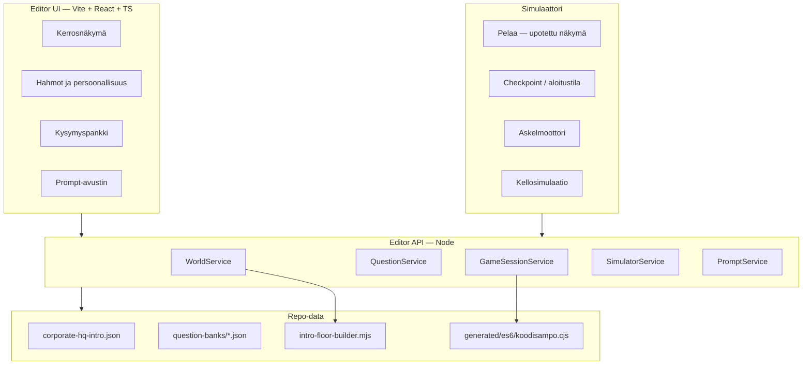
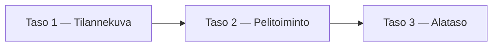

# Koodisampo Game Editor — suunnitelma

> Suunnitelmadokumentti (ei toteutusspec). Tarkoitus: kattava web-pohjainen työkalu maailman, hahmojen, kysymysten ja pelisimulaation arviointiin ja säätöön.
>
> Liittyy: [`world-and-combat-plan.md`](world-and-combat-plan.md), [`question-bank-authoring-prompt.md`](question-bank-authoring-prompt.md), [`scripts-reference.md`](scripts-reference.md)

---

## 1. Ongelma ja tavoite

Nykyinen kehitysloop on hidas arviointiin:

| Nykyinen tapa | Ongelma |
|---------------|---------|
| `scripts/intro-floor-builder.mjs` + `npm run world:merge` | Kerrokset näkee vasta pelissä tai JSON-tiedostosta |
| `corporate-hq-intro.json` käsin | Huoneet, NPC:t ja esineet hajallaan; ei visuaalista yleiskuvaa |
| `npm run play` / `play:web` | Yksi tila kerrallaan; ei “aloita kerroksesta 7 klo 11:00 promootiokortilla” |
| Kysymyspankki `docs/question-bank-index.md` | 1000+ kysymystä; topic–NPC–kerros -yhteys ei näy editorissa |
| Persoonallisuudet (`sociability`, `scheduleRole`, `topic`) | JSON-kenttiä ilman UI:ta |

**Tavoite:** yksi **Game Editor** — web-sovellus jossa voi:

1. **Nähdä** kaikki kerrokset, huoneet ja hahmot kartalla
2. **Säätää** layoutia, NPC:itä ja persoonallisuuksia (myös promptilla)
3. **Selata** kysymyspankkia ja nähdä mitä kukin hahmo kysyy
4. **Tallentaa** setupin (maailma + hahmot + valinnainen pelitila)
5. **Pelata** samasta editorista tallennetulla setupilla
6. **Simuloida** pelin etenemistä halutusta tilanteesta — mahdollisesti askel askeleelta alatasolle asti

---

## 2. Nykytila (lähtökohta)

### 2.1 Maailma ja kerrokset

| Lähde | Rooli |
|-------|-------|
| `content/worlds/corporate-hq-intro.json` | Runtime-maailma (10 kerrosta) |
| `scripts/intro-floor-builder.mjs` | Procedural layout-kerros 2–10 |
| `scripts/merge-intro-upper-floors.mjs` | JSON-generointi (`npm run world:merge`) |
| `hosts/terminal/mapGenerator.mjs` | Vaihtoehtoinen generaattori (testit, ei runtime) |

Kerroksen rakenne:

```json
{
  "id": "floor-3",
  "title": "3. kerros — Kehitysosasto",
  "rows": [{ "line": "#....#" }],
  "entities": [{ "id", "char", "name", "kind", "x", "y", "topic", "scheduleRole", ... }],
  "spawn": { "x", "y" },
  "cafeteria": { "x", "y" }
}
```

ASCII-tilelegend: `#` seinä, `.` lattia, `=` työpiste, `E` hissi, `%` varasto, `+` kokouspöytä, `K` kahvi, `J` vankisolu.

### 2.2 Hahmot ja persoonallisuus

`MapEntity` (`lib/game/ranger/MapEntity.rgr`):

| Kenttä | Käyttö tänään |
|--------|----------------|
| `kind` | coworker, guru, role, security, item, pet, hostile |
| `topic` | encounter-kysymysten chapter-suodatus |
| `scheduleRole` | staff, desk_lunch, mentor, ceo, ceo_lunch, janitor |
| `sociability`, `persistence` | Agenttikäyttäytyminen (jos `isAgent`) |
| `behavior` / `agenda` | wander, seek_player, socialize, arrest |
| `homeX`, `homeY` | Aikataulun “oma työpiste” |
| `storyId` | Kiinteä tarinakohtaaminen (ei quiz) |

**Huom:** intro-maailman työkaverit käyttävät pääasiassa `scheduleRole` + `tickSchedules`; `sociability`/`persistence` ovat käytössä lähinnä generoidussa maailmassa. Editori kannattaa tukea molempia ja näyttää **mikä kenttä vaikuttaa mihin** (live-dokumentaatio paneelissa).

### 2.3 Kysymyspankki

| Lähde | Rooli |
|-------|-------|
| `content/question-banks/*.json` | ~1000 kysymystä |
| `hosts/terminal/encounterQuestions.mjs` | Lataus, topic-suodatus, quiz-valinta |
| `npm run questions:list` / `questions:export` | Inventaario |

NPC `topic` → `chapter` → kysymysjoukko. Editorissa tämä linkki pitää visualisoida.

### 2.4 Olemassa oleva web-debug

`hosts/debug/webPlay.mjs` + `index.html`:

- HTTP API: `GET /api/state`, `POST /api/key`, `POST /api/reset`
- Yksi istunto, kiinteä `corporate-hq-intro.json`
- ASCII-kartta + JSON-tila
- Ei maailman muokkausta, ei checkpointeja, ei kysymysnäkymää

**Tämä on MVP:n luonnollinen perusta** — API ja `GameSession` on jo kytketty selaimeen.

### 2.5 Pelitila (tallennettava)

`playerSave.mjs` tallentaa: karma/features, deaths, quizHistory, studyBacklog, progress (guruIntroPassed, nonces).

`GameSession` sisältää lisäksi: `screen`, `worldClock`, encounter-tila, inventaario/työkalut, karttasijainti — **ei vielä täyttä serialisointia editoria varten**.

---

## 3. Visio: Game Editor

Yksi sovellus, useita välilehtiä/paneeleja, yhteinen datakerros.



**Periaate:** editori **ei duplikoi pelilogiikkaa** — se kutsuu samaa Ranger-runtimea ja `gameHost.mjs`-käärettä kuin `webPlay.mjs`.

---

## 4. UI-moduulit

### 4.1 Kerrosnäkymä (Floor Studio)

**Näkymä:**

- Kerrosvalitsin (0–9) + minikartta kaikista kerroksista
- ASCII-kartta zoomilla; värikoodit tileille ja entity-merkeille
- Huoneiden automaattinen tunnistus (yhtenäiset `#`-alueet) tai myöhemmin eksplisiittinen `rooms[]`-metadata
- Kerättävät esineet, hissi, ruokala-merkintä korostettuna

**Muokkaus (vaiheittain):**

| Vaihe | Toiminto |
|-------|----------|
| MVP | Vain luku + entity-sijoittelu (drag NPC, muuta topic) |
| v2 | Tile-paint (`#`, `.`, `=`, `E`, …) |
| v3 | `intro-floor-builder`-parametrit UI:ssa (arkkitehtuuripresetit) |
| v4 | Prompt: “tee ruokala 2× isommaksi” → ehdottaa builder-muutosta tai JSON-diff |

**Prompt-integraatio (Floor Studio):**

```
Konteksti: kerros 3 ASCII + entities + huonelista
Pyyntö: [käyttäjän prompt]
→ Agentti palauttaa: JSON-patch TAI builder-parametrit TAI uuden rows-blokin
→ Diff-näkymä ennen tallennusta
```

### 4.2 Hahmot huoneittain (Cast & Personality)

**Näkymä:**

- Lista: kerros → huone (tai “käytävä”) → hahmot
- Kartalla klikkaus valitsee hahmon
- Paneeli: nimi, kind, topic, scheduleRole, storyId, sociability, persistence, behavior, agenda, home-piste

**Huone–hahmo-yhteys:**

1. **Sijainti:** entity `(x,y)` ∈ huoneen bounding box
2. **Käytävä:** ei huoneen sisällä → merkitään “käytävässä”
3. **Tulevaisuus:** valinnainen `roomId` entityssä jos halutaan eksplisiittinen sidonta

**Persoonallisuuseditori:**

| Kenttä | UI | Vaikutus (dokumentoitu tooltip) |
|--------|-----|----------------------------------|
| topic | dropdown + haku | Mitä kysymyksiä encounterissa |
| scheduleRole | enum | Lounas, mentor, CEO-kävely |
| sociability | slider 0–100 | Agentti: lähestyy pelaajaa |
| persistence | slider 0–100 | Agentti: ei luovuta |
| behavior | enum | wander, patrol, seek_player |
| agenda | enum | socialize, arrest, seek_larry |

**Esikatselu:** “Mitä tämä hahmo kysyy?” → näytä 5 satunnaista kysymystä topicin perusteella (`pickQuestion`-logiikka).

### 4.3 Kysymyspankki (Question Browser)

- Haku: domain, chapter, difficulty, audience, teksti
- Suodatus: “näytä vain kysymykset joita kerroksen 5 työkaverit voivat kysyä”
- Kysymyskortti: prompt, valinnat, featureId, sourceUrl
- Linkki kartalle: “ketkä NPC:t käyttävät chapter X”
- Pika-toiminnot: avaa `question-bank-authoring-prompt.md` -pohja valitulla aiheella
- Validointi: `questions:validate` tuloste editorissa

### 4.4 Tallenna & pelaa

**Setup-profiili** (`editor-setups/` tai `.koodisampo/editor/`):

```json
{
  "id": "dev-floor-3-review",
  "worldFile": "content/worlds/corporate-hq-intro.json",
  "worldOverrides": null,
  "playerSave": { "features": {}, "progress": { "guruIntroPassed": true } },
  "sessionBootstrap": {
    "floor": 2,
    "playerX": 78,
    "playerY": 27,
    "gameMinutes": 540,
    "tools": ["access_card", "promoted_card"]
  },
  "notes": "Arvioi kehityskerros aamulla"
}
```

**Toiminnot:**

- Tallenna setup → JSON-tiedosto
- “Pelaa tämä setup” → käynnistää upotetun pelinäkymän bootstrap-tilasta
- “Vie tuotantoon” → kirjoittaa `corporate-hq-intro.json` (vahvistus + git-diff)

### 4.5 Pelisimulaattori (Game Simulator)

Kolme **tarkkuustasoa** — sama UI, eri syvyys:



| Taso | Mitä simuloi | Esimerkki |
|------|----------------|-----------|
| **1 – Tilannekuva** | Staattinen snapshot + aikataulu | “Klo 11:00 kerros 2: kuka on ruokalassa?” → `tickSchedules` N kertaa |
| **2 – Pelitoiminto** | Yksi `dispatch`-kierros | Pelaaja liikkuu → encounter → quiz-vastaus → karma-muutos |
| **3 – Alataso** | Ranger-sisäinen tila | `screen`, `encounterResult`, `worldClock`, entity `npcState` ennen/jälkeen |

**Checkpoint-valikko (pikakäynnistykset):**

- Pihamaa, vastaotto, ei korttia
- Kerros 2, varastettu kortti
- Kerros 3, guru passed + promoted_card
- Kerros 10, official_badge
- Custom: lomake (floor, xy, kello, työkalut, karma)

**Simulaattorin näkymä:**

- Vasen: kartta + hahmojen polut (valinnainen)
- Oikea: tila JSON (collapse/expand)
- Ala: toimintojono (toistettava skripti)
  - `move n`, `move e`, `encounter talk`, `quiz 1`, `tick 60` (minuuttia)
- Timeline: kellon eteneminen → NPC-sijainnit päivittyvät

**Toteutus:** laajenna `GameSessionService`:

```typescript
// API-luonnos
POST /api/session/bootstrap   // lataa setup
POST /api/session/step        // { action: "key" | "tick" | "dispatch", payload }
GET  /api/session/history     // edelliset tilat (undo stack)
POST /api/session/record      // tallenna macro / testiskripti
```

---

## 5. Tekninen arkkitehtuuri

### 5.1 Suositus: uusi workspace monorepoon

```
koodisampo/
  editor/                    # NEW — Vite + React + TypeScript
    src/
      panels/                # FloorStudio, Cast, Questions, Simulator, Play
      api/                   # typed client
      components/            # AsciiMap, EntityChip, DiffView
    index.html
    package.json
  editor-server/             # NEW — Node API (tai hosts/editor/)
    index.mjs                # Express/Fastify
    services/
      world.mjs
      session.mjs
      questions.mjs
      simulator.mjs
      prompt.mjs
  hosts/debug/webPlay.mjs    # Säilyy; editor voi korvata ajan myötä
  content/worlds/
  scripts/intro-floor-builder.mjs
```

**npm-skriptit (tuleva):**

```json
"editor:dev": "concurrently \"npm run editor:server\" \"npm run editor --workspace=editor\"",
"editor:server": "node editor-server/index.mjs",
"editor:build": "npm run build --workspace=editor"
```

**Miksi erillinen `editor/` eikä vain `web/`?**

- `web/` on tarinapohjainen legacy-UI (FeatureGarden, StoryList)
- Editori on dev-työkalu: iso, eri UX, ei tuotantopeli
- Jaettu: `generated/es6/koodisampo.cjs`, `gameHost.mjs`, question-moduulit

### 5.2 API-kerros (yhteinen `gameHost` + Ranger)

| Endpoint | Kuvaus |
|----------|--------|
| `GET /api/world` | Lataa maailma (oletus intro) |
| `PUT /api/world` | Tallenna (dev only; varmuuskopio) |
| `POST /api/world/regenerate` | Aja `world:merge` + palauta JSON |
| `GET /api/world/floors/:n/analysis` | Huoneet, entityt huoneittain, tile-stats |
| `GET /api/questions` | Lista/suodata (wrap `listAllQuestions`) |
| `GET /api/questions/for-entity/:id` | Topic → esimerkkikysymykset |
| `POST /api/session/bootstrap` | Luo istunto setupista |
| `GET /api/session/state` | Laajennettu `snapshot()` |
| `POST /api/session/action` | key / tick / encounter |
| `GET /api/setups` | Lista tallennetuista profiileista |
| `POST /api/setups` | Tallenna |
| `POST /api/prompt/floor` | LLM: layout-ehdotus (valinnainen) |
| `POST /api/prompt/personality` | LLM: NPC-kuvaus → kentät |

### 5.3 Jaettu logiikka (älä kopioi)

Nämä importataan suoraan editor-serveriin:

| Moduuli | Käyttö editorissa |
|---------|-------------------|
| `hosts/terminal/gameHost.mjs` | Session lifecycle |
| `hosts/terminal/encounterQuestions.mjs` | Kysymysesikatselu |
| `hosts/terminal/staffRoster.mjs` | Hahmolista, roolimerkit |
| `generated/es6/koodisampo.cjs` | WorldMap, GameSession |
| `scripts/intro-floor-builder.mjs` | Regenerointi parametreilla |

### 5.4 Maailman muokkaus: kaksi polkua

| Polku | Milloin |
|-------|---------|
| **JSON-edit** | Hienosäätö: entity-kentät, yksittäiset tilet |
| **Builder-regenerate** | Iso arkkitehtuurimuutos: kutsu `buildUpperFloor(n)` uusilla parametreilla |

Editori näyttää aina **mistä polusta data tuli** ja varoittaa jos `world:merge` ylikirjoittaa käsin editoidut `rows`.

---

## 6. Data-laajennukset (ehdotus)

Vapaaehtoiset kentät — taaksepäin yhteensopivat:

```json
// MapEntity (editor metadata — ignoroidaan pelissä jos tuntematon)
{
  "personality": {
    "humor": 40,
    "diplomacy": 60,
    "notes": "Nörtti, välttelee smalltalkia"
  },
  "roomId": "floor-3-pod-east",
  "editorTags": ["main-character", "needs-review"]
}

// MapFloor
{
  "rooms": [
    { "id": "cafeteria", "label": "Ruokala", "x": 53, "y": 3, "w": 32, "h": 24 }
  ],
  "architecture": "split-plate"
}
```

`personality`-objekti voi aluksi olla vain editorin käyttöä varten; myöhemmin kytketään `world-and-combat-plan.md`:n Wisdom/Humor-statteihin.

---

## 7. Prompt-avustin

Erillinen paneeli **“Pyydä muutosta”**:

| Konteksti automaattisesti | Käyttäjän prompt | Tulos |
|---------------------------|------------------|-------|
| Valittu kerros ASCII + entities | “Lisää kolme pöytää ruokalaan” | rows-patch |
| Valittu NPC | “Tee aggressiivisempi turvallisuus” | persistence↑, behavior |
| Topic + 3 kysymystä | “Lisää 5 kubernetes-kysymystä” | authoring-prompt valmiina |
| Koko setup | “Taso liian vaikea kerroksella 5” | ehdotus karma/työkaluista |

**Turvallisuus:** kaikki prompt-tulokset → **diff-näkymä** → käyttäjä hyväksyy → vasta sitten tallennus. Ei suoraa tiedostokirjoitusta ilman vahvistusta.

---

## 8. Toteutusvaiheet

### Vaihe 0 — Dokumentti ja spike (1–2 pv)

- [x] Tämä suunnitelma
- [ ] Spike: `editor-server` joka palauttaa `GET /api/world/floors/1/analysis`
- [ ] Spike: staattinen React-kartta yhdestä kerroksesta

### Vaihe 1 — MVP “Katso ja ymmärrä” (1–2 vk)

- [ ] `editor/` + `editor-server/` workspace
- [ ] Kerrosnäkymä: kaikki kerrokset, väritetty ASCII
- [ ] Hahmopaneeli: lista + kenttien editointi (topic, scheduleRole)
- [ ] Kysymyshaku + “mitä tämä NPC kysyy”
- [ ] Upotettu peli (`webPlay`-logiikka): pelaa nykyisellä maailmalla
- [ ] Tallenna/lataa setup JSON (bootstrap: floor + työkalut)

### Vaihe 2 — Simulaattori (1–2 vk)

- [ ] `POST /api/session/bootstrap` + checkpoint-valikko
- [ ] Kellon tick: `worldClock.gameMinutes` + `tickSchedules` → NPC-liike kartalla
- [ ] Askel-askel: näppäin + encounter + quiz
- [ ] Tila-timeline (Historia-paneeli)

### Vaihe 3 — Muokkaus ja prompt (2–3 vk)

- [ ] Entity drag & drop kartalla
- [ ] Tile-paint (rajoitettu sivellinsarja)
- [ ] `world:merge` editorista + diff
- [ ] Prompt-paneeli (paikallinen LLM tai Cursor API — konfiguroitava)
- [ ] Vie `corporate-hq-intro.json`

### Vaihe 4 — Syvä simulaatio (jatkuva)

- [ ] Toistettavat skriptit (macro recorder)
- [ ] Batch-sim: “100 encounteria topic=docker” → tilastot
- [ ] `personality`-kentät pelilogiikkaan
- [ ] Huonetunnistus + automaattinen `rooms[]`

---

## 9. Laatuvaatimukset

| Vaatimus | Mittari |
|----------|---------|
| Yksi totuuden lähde | Peli käyttää editorin tallentamaa JSON:ia ilman erillistä formaattia |
| Ei logiikkaduplikaattia | Session aina `gameHost.mjs` + Ranger |
| Nopea arviointi | Kerros + hahmot + kysymykset < 3 klikkausta |
| Turvallinen tallennus | Diff + varmuuskopio ennen overwrite |
| Testattavuus | Simulator-macroit → `test/editor_sim.test.mjs` |

---

## 10. Avoimet kysymykset

1. **Sijainti:** erillinen `editor/` vs. laajenna `hosts/debug/` — suositus erillinen workspace, jaettu server-koodi.
2. **LLM:** paikallinen (ei avainta) vs. pilvi — aluksi vain “kopioi prompt leikepöydälle”, sitten valinnainen API.
3. **Huoneet:** geometrinen tunnistus vs. eksplisiittinen `rooms[]` — aluksi geometria, myöhemmin metadata.
4. **Serialisointi:** täytyykö `GameSession` saada `exportState()` / `importState()` Rangeriin — simulator tasolla 3 vaatii todennäköisesti.
5. **Tuotanto:** editori vain dev (`localhost`) vai myös sisäinen työkalu tiimille?

---

## 11. Liittyvät komennot (nykyinen)

| Komento | Editorin vastine tulevaisuudessa |
|---------|----------------------------------|
| `npm run world:merge` | “Regeneroi kerrokset” -nappi |
| `npm run play:web` | “Pelaa”-välilehti |
| `npm run questions:list` | Question Browser |
| `npm run questions:validate` | Validointipaneeli |
| `npm run scripts:export` | Dokumentaatio-linkki |

---

## 12. Yhteenveto

Game Editor yhdistää kolme tähän asti erillistä työkaluketjua:

1. **Maailmanrakentaja** (`intro-floor-builder` + JSON)
2. **Sisältötyökalut** (kysymyspankki, authoring-promptit)
3. **Debug-peli** (`webPlay.mjs`)

Yksi web-käyttöliittymä, jossa voi **nähdä**, **säätää** (käsin ja promptilla), **tallentaa**, **pelata** ja **simuloida** saman Ranger-moottorin päällä — ilman että pelilogiikkaa kirjoitetaan uudestaan.

Seuraava konkreettinen askel: **Vaihe 0 spike** — `GET /api/world/floors/:n/analysis` + yksinkertainen ASCII-karttanäkymä Reactilla.
