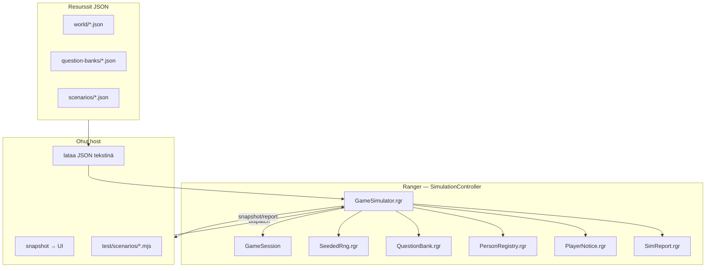

# Ranger Simulation Controller — suunnitelma

> Suunnitelmadokumentti (2026-06). Tavoite: siirtää host-kontrollerin simulointilogiikka Rangeriin niin, että peliä, tapahtumia ja kysymyksiä voi ajaa **headlessinä**, toistettavasti ja raportoitavasti — ilman web/Android/terminaali-UI:ta.

Liittyy: [android-web-controller-parity.md](./android-web-controller-parity.md), [game-editor-plan.md](./game-editor-plan.md).

---

## 1. Yhteenveto

Tänään pelilogiikan **~65%** on Rangerissa (`GameSession`, `WorldMap`), mutta täysi pelikierros (quiz, suositusportti, tallennus) vaatii host-kerroksen (`encounterQuestions.mjs`, `personStatus.mjs`, `webGameController.mjs`).

**Tavoite:** uusi **`GameSimulator`** (tai `SimulationController`) Ranger-prosessina, joka tarjoaa yhden API:n:

| Toiminto | Kuvaus |
|----------|--------|
| `bootstrap(setup)` | Aseta lähtötila (kartta, kerros, xy, kello, työkalut, karma, NPC:t) |
| `step(action)` | Yksi pelitoiminto (näppäin, encounter-valinta, quiz-vastaus, odota) |
| `tick(minutes)` | Kellon eteneminen + NPC-aikataulut + taustatapahtumat |
| `snapshot()` | Pelaajalle näkyvä tila (kartta, viestit, overlay) |
| `report()` | Simulaation yhteenveto (metriikat, tapahtumaloki, virheet) |

Host (web, Android, terminaali, testit) muuttuu **ohuksi adapteriksi**: lataa JSON-resurssit, kutsuu Rangeria, renderöi snapshotin.



---

## 2. Nykytila vs tavoite

| Ominaisuus | Nyt Rangerissa | Nyt hostissa | Tavoite |
|------------|----------------|--------------|---------|
| Kartta, liike, hissi | ✅ | snapshot vain | ✅ Ranger |
| Kellon aika | ✅ `WorldClock` | `virtualClock.mjs` wrapper | ✅ Ranger + `tick()` API |
| NPC-liike / aikataulu | ✅ `tickSchedules` | — | ✅ laajennetaan |
| Ambient-viestit (kuullut) | ✅ `overheardMsg` | — | ✅ yhdistetään `PlayerNotice`-järjestelmään |
| Pelaajan “mielenhäiriöt” / flavor | ❌ | — | ✅ uusi `PlayerNotice` |
| Quiz-valinta + historia | ❌ | `encounterQuestions.mjs` | ✅ `QuestionBank.rgr` |
| Suositusportti | ❌ | `personStatus.mjs` | ✅ `PersonRegistry.rgr` |
| Tilan asetus (checkpoint) | ⚠️ käsin `dispatch` | `gameTestHarness.mjs` | ✅ `bootstrap(setup)` |
| Skenaarioskriptit | ❌ | erilliset testit | ✅ `scenarios/*.json` |
| Simulaatioraportti | ❌ | — | ✅ `SimReport` |
| Seedattu RNG | ⚠️ `random` ilman seediä | hash-pohjainen quiz | ✅ `SeededRng` |

---

## 3. Kuusi vaatimusta — suunnittelu

### 3.1 Tilan asetus (lähtökohta)

**Tavoite:** yhdellä kutsulla asettaa “missä ollaan” — editorin checkpoint-valikko, yksikkötesti tai batch-simulaatio.

#### `ScenarioSetup` (JSON)

```json
{
  "id": "courtyard-no-card",
  "worldId": "corporate-hq-intro",
  "seed": 42,
  "clockMinutes": 480,
  "player": {
    "floor": 0,
    "x": 28,
    "y": 16,
    "hidden": false
  },
  "progress": {
    "interviewPassed": false,
    "guruIntroPassed": false,
    "guruQuizCorrect": 0,
    "deaths": 0
  },
  "karma": { "total": 50, "featureIds": [], "amounts": [] },
  "tools": ["access_card"],
  "personRegistry": {},
  "quizHistory": {},
  "npcOverrides": [
    { "id": "receptionist", "x": 30, "y": 14, "npcState": "desk", "offDuty": false }
  ],
  "tags": ["intro", "smoke"]
}
```

#### Ranger-API

```ranger
// GameSimulator.rgr — luonnos
fn bootstrap:void (setupJson:string) {
  sim.clearReport()
  sim.rng.seedFromSetup(setup)
  session.loadMapFromText(worldJson)
  session.applyScenarioSetup(setup)   // uusi GameSession-metodi
  map.tickSchedules(worldClock.gameMinutes)
  sim.logEvent("bootstrap" setup.id)
}
```

#### Valmiit checkpoint-presetit

| ID | Kuvaus |
|----|--------|
| `courtyard-fresh` | Piha, ei korttia, aamu 08:00 |
| `lobby-interview` | Vastaanotto, haastattelu edessä |
| `floor2-promoted` | Kerros 2, guru passed + promoted_card |
| `floor10-badge` | Kerros 10, official_badge |
| `custom` | täysi `ScenarioSetup` |

**Toteutus:** `content/scenarios/presets/*.json` + `GameSession.applyScenarioSetup()` joka asettaa kentät ilman host-logiikkaa.

---

### 3.2 Simuloitu aika

**Nykyinen:** `WorldClock.gameMinutes`, `advance()`, `setGameMinutes()` (Ranger). Hostin `virtualClock.mjs` kutsuu näitä + `map.tickSchedules()`.

**Tavoite:** yksi `tick(minutes)` simulaattorissa.

#### Käyttäytyminen

| Kutsu | Vaikutus |
|-------|----------|
| `tick(0)` | Vain snapshot (ei muutosta) |
| `tick(15)` | Kello +15 min, `tickSchedules`, NPC-agentit, mahdolliset taustatapahtumat |
| `setClock(660)` | Hyppy lounaaseen (testeissä) |
| `waitUntil(phase)` | Esim. `"lounas"` → kelaa kunnes `phaseLabel` täsmää (max turvaraja) |

#### Aikataulun vaikutukset (jo olemassa Rangerissa)

- `scheduleRole`: `desk`, `desk_lunch`, `ceo_lunch`, `janitor`, `mentor`
- `npcState`: `desk`, `lunch`, `lunch_out`, `leaving`, `gone`
- Agentit: `agentGoal == "seek_larry"` (poliisi), `wander`, `patrol`

#### Uusi: aikapohjaiset pelaajaviestit

Kello voi laukaista `PlayerNotice`-tapahtumia (ks. 3.4):

```json
{
  "trigger": "clock",
  "afterMinutes": 720,
  "once": true,
  "message": "Vatsa murisee — lounasaika lähestyy."
}
```

---

### 3.3 Pelaajan ja NPC-hahmojen päätösten simulointi

Kaksi tasoa: **ohjattu** (skripti) ja **automaattinen** (AI/policy batch-simulaatioon).

#### Taso A — Ohjattu skripti (ensisijainen)

Skenaario määrittelee toimintojonon. Simulaattori suorittaa sen askel askeleelta.

```json
{
  "setup": "courtyard-fresh",
  "script": [
    { "move": "e" },
    { "move": "e" },
    { "encounter": "talk" },
    { "quiz": 1 },
    { "tick": 30 },
    { "key": "2" },
    { "assert": { "floor": 1 } }
  ]
}
```

**Ranger `step(action)` — tuetut tyypit:**

| action | Ranger-kutsu |
|--------|--------------|
| `key: "w"` | `session.onMapKey("w")` |
| `encounter: "talk"` | `session.onEncounterChoice("talk")` + quiz-flow |
| `quiz: 2` | `sim.answerQuiz(1)` (0-based sisäisesti) |
| `story: "choice-id"` | `session.onStoryChoice(...)` |
| `tick: 60` | `sim.tick(60)` |
| `tool: "crowbar"` | työkaluvalinta action-näytössä |

#### Taso B — NPC-päätökset (Rangerissa jo osittain)

| Mekanismi | Tiedosto | Kuvaus |
|-----------|----------|--------|
| Aikataulu | `WorldMap.tickSchedules` | NPC siirtyy ruokalaan, poistuu jne. |
| Agentti | `stepAgent`, `tryAgentAmbient` | Poliisi etsii piilotettua pelaajaa |
| Satunnainen liike | `wanderRoll`, `patrolRoll` | Vapaaehtoinen liike |
| Kohtaus | `bumpAtPlayer` → encounter | Pelaajan törmäys NPC:hen |
| Sosiaalisuus | `MapEntity.sociability` | **Tuleva:** vaikuttaa ambient-todennäköisyyteen |

#### Taso C — Automaattinen pelaaja (myöhemmin)

Yksinkertainen policy batch-ajoihin:

```json
{
  "playerPolicy": "greedy_explore",
  "goal": "reach_floor:3",
  "maxSteps": 500
}
```

Policyt simulaattorissa (ei ML): `random_walk`, `greedy_explore`, `quiz_always_correct`, `quiz_always_wrong`.

---

### 3.4 Pelaajalle näkyvät infoviestit

Tänään viestit ovat hajallaan:

| Lähde | Kenttä | Esimerkki |
|-------|--------|-----------|
| Toimintojen tulos | `map.lastStatus` | “Poimit työkalun: sorkkarauta” |
| Ambient / kuullut | `map.overheardMsg` → `MapView.ambientLine` | “Kollega: \"Missä Larry on?\"" |
| Vihje | `MapView.hintLine` | “wasd \| e=työkalu…” |
| Aika | `MapView.timeLine` | “08:00 — aamu” |
| Encounter | `EncounterView.greeting` | Haastatteluteksti |

**Ongelma:** ei yhtenäistä kanavaa “flavor”-viesteille (valkosipuli, outo ääni seinän takaa).

#### Uusi: `PlayerNotice.rgr`

Yhtenäinen jonotettu viestijärjestelmä:

```ranger
class PlayerNotice {
  def id:string ""
  def channel:string ""      // "status" | "ambient" | "flavor" | "system"
  def priority:int 0         // korkeampi = näkyy ensin
  def text:string ""
  def ttlTurns:int 1         // kuinka monta snapshotia näkyy
  def source:string ""       // "rng" | "room" | "npc:staff-f2-1" | "script"
}
```

`GameSimulator.snapshot()` yhdistää:

1. `lastStatus` (status-kanava)
2. Aktiiviset `PlayerNotice`-rivit (flavor, ambient)
3. `overheardMsg` (siirretään notice-jonoon, deprecate suora kenttä myöhemmin)
4. `hintLine`, `timeLine` (UI-metatiedot)

#### Flavor-tapahtumat (esimerkkejä)

| Laukaisin | Viesti |
|-----------|--------|
| `rng` + `room:kitchen` | “Sinun tekee yhtäkkiä mieli syödä valkosipulia.” |
| `rng` + `adjacent:wall` | “Kuulet että joku juttelee seinän takana.” |
| `clock:lounas` | “Kahvihuoneesta leijuu tuoksu.” |
| `npcState:lunch` | “Ruokalan käytävä on ruuhkainen.” |
| `karma:low` | “Tunnet olosi epävarmaksi.” |

#### Määrittely skenaariossa / huoneessa

```json
{
  "rooms": [
    {
      "id": "kitchen",
      "bounds": { "x0": 10, "y0": 5, "x1": 18, "y1": 12 },
      "flavor": [
        {
          "weight": 3,
          "cooldownMinutes": 45,
          "messages": [
            "Joku on jättänyt mikron auki.",
            "Sinun tekee mieli valkosipulikeittoa."
          ]
        }
      ]
    }
  ]
}
```

**Huom:** aluksi `rooms[]` voi olla erillinen metadata world-JSONissa; myöhemmin geometrinen tunnistus editorista ([game-editor-plan.md](./game-editor-plan.md)).

---

### 3.5 Eri huoneet, kartat ja hahmot + raportti

**Tavoite:** kokeilla vaihtoehtoisia pelikenttiä ja casteja, ajaa N simulaatiota, saada raportti ulos.

#### Maailman lataus

```ranger
fn loadWorld:void (worldJson:string) {
  map.loadFromText(worldJson)
}
```

Eri lähteet:

| Lähde | Käyttö |
|-------|--------|
| `content/worlds/corporate-hq-intro.json` | tuotantomaailma |
| `content/worlds/experiments/kitchen-test.json` | yksittäinen huone |
| `mapGenerator` (host) → JSON → Ranger | generoidut kerrokset |

Simulaattori **ei** generoi karttoja — host tuottaa JSONin, Ranger suorittaa.

#### Batch-ajo

```json
{
  "batch": {
    "name": "floor2-encounter-smoke",
    "worldId": "corporate-hq-intro",
    "seeds": [1, 2, 3, 4, 5],
    "setup": "floor2-promoted",
    "script": [
      { "encounter": "talk" },
      { "quiz": 1 }
    ],
    "repeat": 20
  }
}
```

CLI: `node scripts/run-scenario.mjs content/scenarios/batch/floor2-quiz.json`

#### Raportti (`SimReport`)

```json
{
  "scenarioId": "floor2-encounter-smoke",
  "seed": 42,
  "duration": { "steps": 12, "simMinutes": 45 },
  "outcome": "pass",
  "assertions": [
    { "id": "floor", "expected": 1, "actual": 1, "ok": true }
  ],
  "metrics": {
    "encounters": 1,
    "quizzes": 1,
    "quizCorrect": 1,
    "karmaDelta": 8,
    "noticesShown": 3,
    "npcMoves": 7
  },
  "eventLog": [
    { "step": 0, "type": "bootstrap", "detail": "courtyard-fresh" },
    { "step": 3, "type": "encounter", "entity": "receptionist" },
    { "step": 4, "type": "quiz", "questionId": "cpp-tools-042", "correct": true },
    { "step": 4, "type": "notice", "channel": "flavor", "text": "..." }
  ],
  "warnings": [],
  "errors": []
}
```

**Raportin formaatit:** JSON (automaatio), Markdown (ihmisluettava), lyhyt teksti (CI).

```markdown
## floor2-encounter-smoke (seed=42)
- **Tulos:** PASS (12 askelta, 45 sim-min)
- **Quiz:** 1/1 oikein, karma +8
- **Huomiot:** flavor×2, ambient×1
```

---

### 3.6 Deterministinen satunnaisluku (seedattu RNG)

**Periaate:** kaikki “satunnaisuus” kulkee yhden `SeededRng`-instanssin kautta. Sama seed + sama skripti → sama tulos.

#### `SeededRng.rgr`

```ranger
class SeededRng {
  def state:int 0

  fn seed:void (n:int) {
    state = n
  }

  fn next:int (min:int max:int) {
    // mulberry32 — sama algoritmi kuin shuffleChoices.mjs / EncounterQuizEngine.kt
    ...
  }

  fn chance:boolean (numerator:int denominator:int) {
    return (this.next(0 denominator - 1) < numerator)
  }
}
```

#### Korvattavat `random`-kohdat

| Kohde | Nykyään | Tavoite |
|-------|---------|---------|
| `WorldMap.tryCoworkerDropCard` | `random 0 24` | `sim.rng.next(0, 24)` |
| NPC wander/patrol | `random` | `sim.rng` |
| Encounter promo-roll | `random 0 2` | `sim.rng` |
| Quiz-valinta | host hash | `sim.rng` + historia |
| Vastaussekoitus | host hash | `sim.rng` + questionId |
| Flavor-viestit | — | `sim.rng` |

#### Uusi peli vs toistettava testi

| Käyttö | Seed |
|--------|------|
| Uusi satunnainen peli | `seed = wallClock()` tai käyttäjän valinta |
| Yksikkötesti | `seed = 42` (kiinteä) |
| Batch-regressio | `seeds: [1..100]` |
| “Uusi random peli” napista | `seed = random32()` **hostissa**, välitetään `bootstrap`-kutsussa |

**Tärkeää:** seed asetetaan **vain** `bootstrap()`-kutsussa. `step()` ja `tick()` eivät vaihda seediä.

---

## 4. Mitä siirretään hostista Rangeriin

Prioriteettijärjestys:

| # | Moduuli | Lähde | Ranger-kohde |
|---|---------|-------|--------------|
| 1 | `SeededRng` | `shuffleChoices.mjs` | `SeededRng.rgr` |
| 2 | `QuestionBank` + pick/shuffle | `encounterQuestions.mjs` | `QuestionBank.rgr`, `EncounterQuiz.rgr` |
| 3 | `PersonRegistry` | `personStatus.mjs` | `PersonRegistry.rgr` |
| 4 | `QuizHistory` | `quizHistory.mjs` | `QuizHistory.rgr` |
| 5 | `GameSimulator` | `createGameController.mjs` | `GameSimulator.rgr` |
| 6 | `PlayerNotice` | — (uusi) | `PlayerNotice.rgr` |
| 7 | `SimReport` | — (uusi) | `SimReport.rgr` |
| 8 | Hissi-UI-tila | `elevatorUiState.mjs` | **jää hostissa** (pelkkä UI) |

Host säilyttää:

- JSON-tiedostojen lukeminen levyltä / asset-paketista
- Snapshotin renderöinti (web, Android, terminaali)
- Tallennus (localStorage, DataStore)
- `mapGenerator.mjs` (tuottaa JSONin Rangerille)

---

## 5. API — kokonaiskuva

### Ranger (`GameSimulator` prosessi tai `GameSession`-laajennus)

```
bootstrap(setupJson, worldJson, questionBankJson)
step(actionJson) → snapshotJson
tick(minutes) → snapshotJson
snapshot() → snapshotJson
report() → reportJson
reset()
```

### Snapshot (yhteensopiva web/Android)

```json
{
  "screen": "map",
  "floor": 0,
  "player": { "x": 28, "y": 16, "hidden": false },
  "clockMinutes": 495,
  "clockLine": "08:15 — aamu",
  "status": "Vastaanottovirkailija haluaa jutella.",
  "notices": [
    { "channel": "flavor", "text": "Kuulet kahvin valuvan jossain lähellä." },
    { "channel": "ambient", "text": "Kollega: \"Missä Larry on?\"" }
  ],
  "hint": "wasd | e=työkalu | ...",
  "lines": ["..."],
  "onElevator": false,
  "encounter": null,
  "rngSeed": 42
}
```

### Ohut host-wrapper (JS testit + editor)

```javascript
// hosts/shared/gameSimulator.mjs — tuleva
export function createGameSimulator({ worldJson, questionBankJson, setup }) {
  const { root, session } = createGameSession();
  const sim = session.__rangerFindSimulator(); // tai erillinen prosessi
  dispatch(session, () => sim.bootstrap(JSON.stringify(setup), worldJson, questionBankJson));
  return {
    step: (action) => dispatch(session, () => sim.step(JSON.stringify(action))),
    tick: (min) => dispatch(session, () => sim.tick(min)),
    snapshot: () => JSON.parse(sim.snapshotJson()),
    report: () => JSON.parse(sim.reportJson()),
    stop: () => stopGameSession(root, session),
  };
}
```

---

## 6. Toteutusvaiheet

### Vaihe 0 — Dokumentaatio ja skeemat (nyt)

- [x] Tämä suunnitelma
- [ ] `content/scenarios/README.md` — skenaarioformaatti
- [ ] JSON Schema: `ScenarioSetup`, `SimScript`, `SimReport`

### Vaihe 1 — Perussimulaattori (1–2 vk)

- [ ] `SeededRng.rgr` + korvaa yksi `random`-kohta (todistus)
- [ ] `GameSession.applyScenarioSetup()` — floor, xy, tools, progress
- [ ] `GameSimulator.bootstrap/step/snapshot/report` (ilman quizia)
- [ ] `test/scenarios/courtyard-move.json` + `scripts/run-scenario.mjs`
- [ ] Raportti: steps, assertions, eventLog

**Valmis kun:** “liiku hissille → paina 2” toistettavasti seed=42.

### Vaihe 2 — Aika ja NPC (1 vk)

- [ ] `tick(minutes)` integroitu simulaattoriin
- [ ] Snapshot sisältää `clockLine`, NPC-sijainnit
- [ ] Testi: `tick(180)` → kollegat ruokala-tilassa
- [ ] Raportti: `npcMoves`, `simMinutes`

### Vaihe 3 — Quiz + registry Rangeriin (2 vk)

- [ ] `QuestionBank.rgr` — JSON lataus, pick, shuffle (`SeededRng`)
- [ ] `PersonRegistry.rgr` — suositusportti
- [ ] `QuizHistory.rgr`
- [ ] Skenaario: vastaanotto → quiz → suositus → kerros 2
- [ ] Poista riippuvuus `encounterQuestions.mjs`:stä testeissä

**Valmis kun:** `intro-receptionist-to-floor2.json` ajaa ilman host-cheateja.

### Vaihe 4 — PlayerNotice + flavor (1–2 vk)

- [ ] `PlayerNotice.rgr` + snapshot-kanava
- [ ] `rooms[]` metadata world-JSONissa
- [ ] Flavor-laukaisimet: rng, clock, room, adjacent-wall
- [ ] Raportti: `noticesShown` kanavittain

### Vaihe 5 — Batch + editor-integraatio (jatkuva)

- [ ] `run-scenario.mjs --batch` → CSV/MD-raportti
- [ ] Editorin Simulator-välilehti ([game-editor-plan.md](./game-editor-plan.md))
- [ ] Automaattinen policy (`greedy_explore`) kokeilukarttoihin
- [ ] `exportState/importState` — täysi checkpoint tallennus

---

## 7. Esimerkkiskenaariot (tavoitetila)

### `content/scenarios/intro-receptionist-to-floor2.json`

```json
{
  "id": "intro-receptionist-to-floor2",
  "seed": 42,
  "setup": {
    "preset": "courtyard-fresh",
    "tools": []
  },
  "script": [
    { "comment": "Kävele vastaanottoon" },
    { "move": "n", "repeat": 8 },
    { "move": "e", "repeat": 5 },
    { "encounter": "talk" },
    { "quiz": 1, "comment": "ensimmäinen vastaus" },
    { "key": "enter" },
    { "move": "w", "repeat": 3 },
    { "key": "2", "comment": "hissi kerros 2" },
    { "assert": { "floor": 1, "interviewPassed": true } }
  ]
}
```

### `content/scenarios/experiments/kitchen-flavor-batch.json`

```json
{
  "id": "kitchen-flavor-batch",
  "worldId": "experiments/kitchen-test",
  "seeds": [1, 2, 3, 4, 5],
  "setup": { "player": { "floor": 0, "x": 5, "y": 5 }, "clockMinutes": 720 },
  "script": [
    { "tick": 30 },
    { "tick": 30 },
    { "assert": { "noticesMin": 1, "noticeChannel": "flavor" } }
  ],
  "report": { "format": "markdown", "aggregate": true }
}
```

---

## 8. Testaus

| Taso | Työkalu | Kattavuus |
|------|---------|-----------|
| Yksikkö | `npm run test:engine` | Ranger-moduulit |
| Skenaario | `npm run test:scenarios` | JSON-skriptit |
| Batch | `npm run sim:batch` | regressio + tilastot |
| CI | sama seed → sama raportti | determinismi |

**Uusi npm-skripti (tavoite):**

```json
"test:scenarios": "npm run build:ranger && node scripts/run-scenario.mjs content/scenarios/**/*.json",
"sim:batch": "node scripts/run-scenario.mjs --batch content/scenarios/batch/"
```

---

## 9. Avoimet kysymykset

1. **`GameSimulator` erillisenä prosessina vs `GameSession`-metodit?**  
   Suositus: aluksi `GameSession`-kentät + metodit (vähemmän boilerplatea); erillinen prosessi jos tila kasvaa liian suureksi.

2. **Huoneet: geometria vs eksplisiittinen `rooms[]`?**  
   Aluksi eksplisiittinen metadata editorissa; myöhemmin automaattinen tunnistus.

3. **Flavor-viestit: kiinteä lista vs generointi?**  
   Aluksi kiinteät listat world/scenario JSONissa; myöhemmin LLM ei kuulu simulaattorin ytimeen.

4. **Quiz-pankin koko Ranger-binääriin?**  
   Host lataa JSON → `loadQuestionBankFromText`. Ei upoteta kaikkia kysymyksiä `.rgr`-tiedostoon.

5. **Web/Android migraatio?**  
   Kun Vaihe 3 valmis: `webGameController` delegoi `GameSimulator`-snapshotille; host-logiikka poistuu vähitellen.

---

## 10. Liitteet — nykyiset tiedostot

| Tarkoitus | Polku |
|-----------|-------|
| Peliydin | `lib/game/ranger/process/GameSession.rgr` |
| Kartta + NPC | `lib/game/ranger/WorldMap.rgr` |
| Kello | `lib/game/ranger/WorldClock.rgr` |
| Ohut kontrolleri (nykyinen) | `hosts/shared/gameController/createGameController.mjs` |
| Testiharness | `test/support/gameTestHarness.mjs` |
| Quiz (siirrettävä) | `hosts/terminal/encounterQuestions.mjs` |
| Registry (siirrettävä) | `hosts/terminal/personStatus.mjs` |
| Pariteettianalyysi | `docs/android-web-controller-parity.md` |
| Editor-simulaattori | `docs/game-editor-plan.md` §4.5 |

---

## 11. Yhteenveto yhdellä lauseella

**Rangeriin rakennetaan `GameSimulator`, joka ottaa vastaan tilan asetuksen, seedatun RNG:n, aika- ja NPC-simulaation, yhtenäiset pelaajaviestit ja skenaarioskriptit — ja palauttaa snapshotin sekä raportin; host lataa vain JSON-resurssit ja renderöi.**

Seuraava konkreettinen askel: **Vaihe 1** — `SeededRng.rgr` + `applyScenarioSetup` + yksi toimiva `courtyard-move.json` -skenaario.
